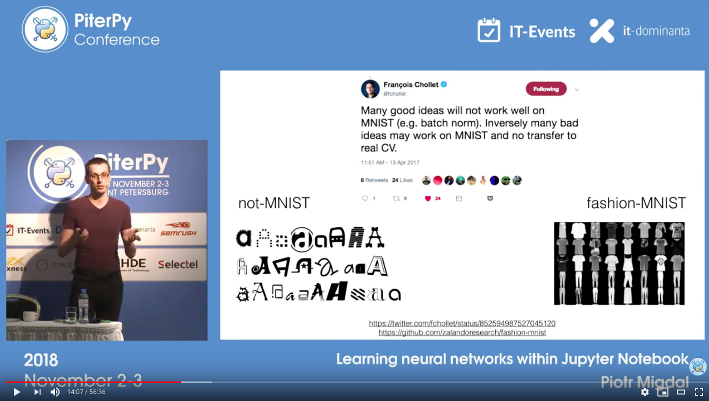

# keras-interactively-piterpy2018

[Piotr Migdał](https://p.migdal.pl/), "Learning neural networks within Jupyter Notebook" talk at [PiterPy](https://piterpy.com/) 2018

* Slides: https://www.dropbox.com/s/4olwdmp7a70x51w/20181103%20deep%20learning%20jupyter%20notebook%20piterpy.pdf?dl=0
* Recording:
  * **RUS** https://www.youtube.com/watch?v=qomCrfctf70
  * **ENG** https://www.youtube.com/watch?v=5T1ADUruxTo
* Code: https://github.com/stared/keras-interactively-piterpy2018/blob/master/talk.ipynb (for a slideshow with a Python kernel, I use [RISE](https://github.com/damianavila/RISE))

I started writing a course in that spirit, see: [Thinking in tensors, writing in PyTorch](https://github.com/stared/thinking-in-tensors-writing-in-pytorch).
